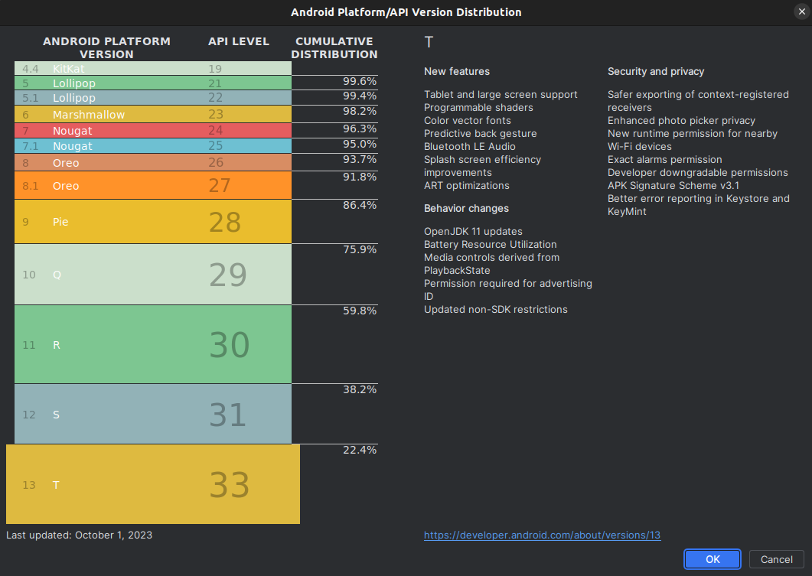
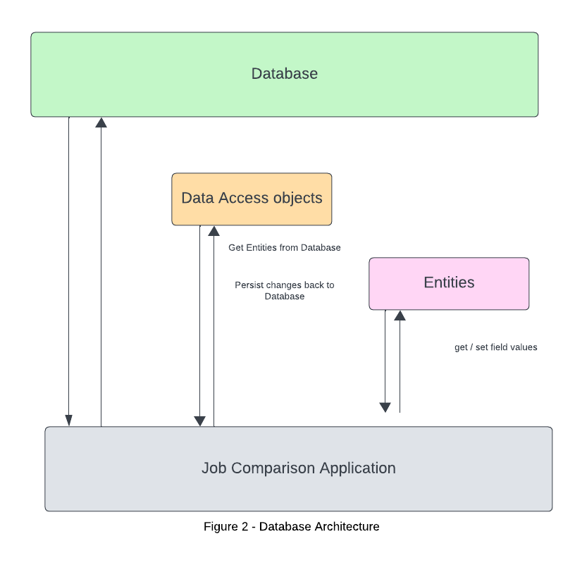
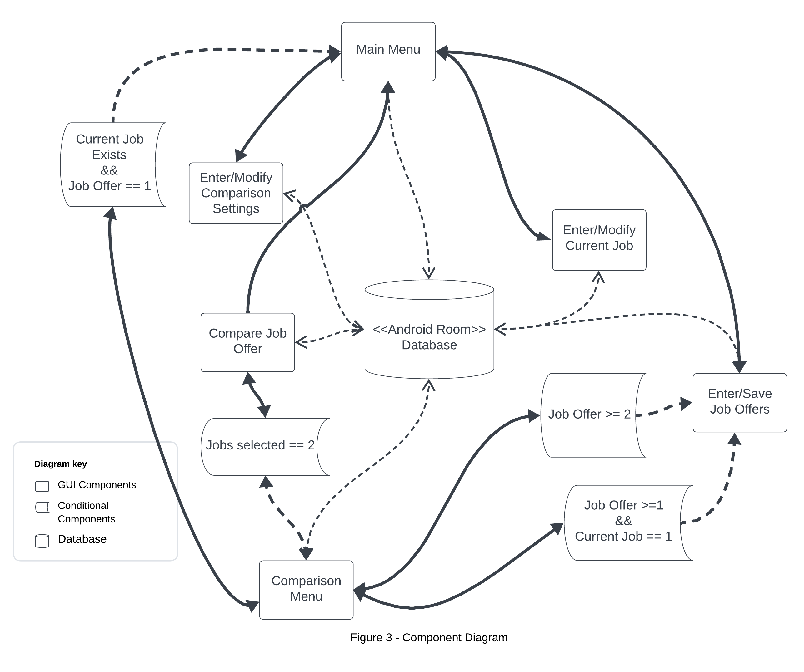
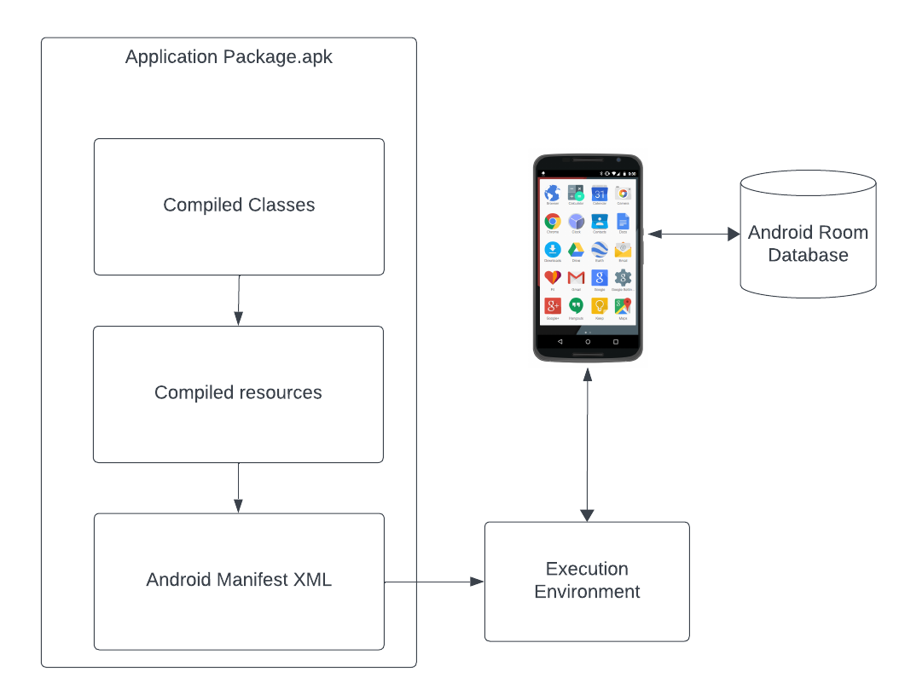
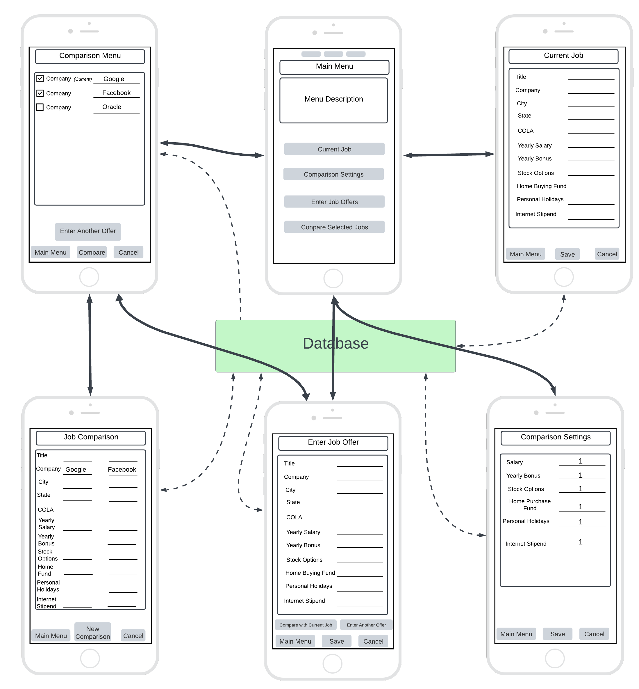

# Design Document

## 1 Design Considerations

### 1.1 Assumptions

##### 

- The user should be able to enter and remove job details, job offers, adjust comparison settings, and compare jobs
- Data that has been entered into the system is persisted, and is loaded after the application is opened back up.
- The user will have sufficient hardware capabilities to handle the application's performance requirements.
- Android Room provides a reliable method for the user to store data.
- Standard security practices will adequately protect user data from unauthorized access.

### 1.2 Constraints

#### Platform Compatibility

- The application targets Android 13, introducing behavior changes and new
   APIs that may affect user experience. To ensure broad compatibility, 
  testing across devices running Android 12 through Android 13 is 
  critical, as API availability varies by version.

- The large Android ecosystem effects how different devices may or may not 
  uniformly adopt Android 13. This could impact functionality or 
  appearance. Figure [1] illustrates the current distribution of Android 
  13 users, highlighting the importance of compatibility considerations.



#### Platform Security

- Adhering to regulations for handling Personally Identifiable Information
   (PII) is crucial due to the sensitive nature of data like salary 
  details. While Android Room adds a layer of abstraction over SQLite, we will employ SQLCipher for full database encryption and additional field-level encryption for heightened security. Despite these precautions, we recognize that no encryption method is impervious to attacks.

#### Reliability on User data/memory

- The use of Android Room defines a SQLite database that resides on the users local device. Because the database is stored locally, an internet connection is not required. However, this relies on the user to have enough memory on their device to execute requests. Inadequate user memory will prevent the application's ability to function correctly, relying on user awareness of their device's storage capabilities to prevent execute all requests as intended.

#### User Accessibility

- Designing an application to be intuitive and responsive, but also adhere to accessibility guidelines often oppose one another. The design must comply with regulatory rules to comply with accessibility guidelines. This may limit design aspects such as contrast, color, bright images, etc. While Android provides accessibility hints, lack of access to a robust team to conduct usability testing will present a challenge to our four person group.


### 1.3 System Environment

#### Database Management

- Android Room will be used for database management.

- The Room persistence library provides an abstraction layer over SQLite to allow
  fluent database access while harnessing the full power of SQLite. In particular,
  Room provides the following benefits:
  
  - Compile-time verification of SQL queries.
  - Convenience annotations that minimize repetitive and error-prone boilerplate
    code.
  - Streamlined database migration paths

#### Android 13 & API 33

- The application is designed for Android Operating System. Specifically, android 13 is the targeted system, and SDK 33 is the targeted SDK. Usability testing is conducted to ensure broad use and compatibility with the broader Android audience.

#### Development Environment

- The Application is developed using Android Studios

- Gradle 8.2 is used to compile, build, and package the application

- Java 17 is the primary programming language. However, the application contains XML, and Structured Query Language (SQL).

- A collaborative Git environment is used for version control, data integrity, and workflow management.

## 2 Architectural Design

#### Database Architecture



Figure 2 represents the broad architectural structure for the Database class. The database class defines the database configuration and serves as the application's main access point to the persisted data. The class is annotated with a `@Database` annotation that includes an entities array that lists all of the data entities associated with the database. The class must be an abstract class that extends the Database class. For each Data Access Object (DAO) class that is associated with the database, the database class must define an abstract method that has zero arguments and returns an instance
of the DAO class.

The database will be responsible to store and retrieve all information about the users current job, job offers, and comparison settings

To visualize this, it's helpful to think of data entities as objects within the Database Room. Entities in Room represent the app's data structures, which are mapped to tables within the SQLite database. Each entity, annotated with @Entity, corresponds to a table where its fields represent columns. The @primaryKey specifies that the 'id' field as the primary key, and it will be automatically generated. These can be referenced later for specific purposes. @ColumnInfo is used to specify the name of the column in the database, ensuring our data model aligns with our database layout. For example, in our Job entity, fields like title, company, city, and state are mapped to respective columns, facilitating organized data storage and retrieval.

```
@Entity
public class Job {
    @PrimaryKey
    public int uid;
    
    @ColumnInfo(title = "title")
    public String title;

    @ColumnInfo(company = "company")
    public String company;

    @ColumnInfo(city = "city")
    public String city;
     
    @ColumnInfo(state = "state")
    public String state;
}
```

The DAO (Data Access Object) plays the role of abstracting the complexity of database access. Annotated with @Dao, it defines a set of methods for performing database operations, allowing to perform queries and manipulations. Methods within a DAO interface are annotated to represent specific SQL queries or transactions. In the code below, we use @Query for fetching data, @Insert for adding records, and @Delete for removing them. Each method performs interactions with the database. For example, our JobDao includes methods for retrieving job entries, inserting multiple jobs, and deleting a specific job.

```
@Dao
public interface JobDao {
    @Query("SELECT * FROM job")
    List<Job> getAll();

    @Query("SELECT * FROM job WHERE title = :title AND company = :company")
    Job findByTitleAndCompany(String title, String company);

    @Insert
    void insertAll(Job... jobs);

    @Delete
    void delete(Job job);
}
```

### 2.1 Component Diagram



The component diagram depicted in figure 3 displays the structural relationships between the components in the application. Components are autonomous, encapsulated units within the application.

The Main Menu serves as the central hub from which users can navigate to various functionalities: Comparison Settings, Current Job Details, and Job Offers. Each of these functionalities is represented as a distinct component, reflecting their one-to-one relationship with the Main Menu. There is one condition which enable the user to access the comparison menu from the main menu. If the user already has entered a current job, and the user has entered at least one job offer, then they are able to navigate to the comparison menu.

Job Offers component allows navigation to the Comparison Menu under two specific conditions: If the user has entered at least two job offers, or the user has entered one job offer and has entered a current job, the user may navigate to the comparison menu.

The Comparison Menu acts as a gateway to the Compare Job Offers component, which is accessible when the user has selected at least two jobs for comparison. It also provides options for the user to navigate back to the Main Menu or to the Job Offers component.

In the Compare Job Offers component, users can view selected job offers as a side-by-side comparison. From here, users can initiate a new comparison by returning to the Comparison Menu or choose to go back to the Main Menu.

### 2.2 Deployment Diagram



This application is developed as a school project and not intended for immediate real-world deployment. However, understanding the deployment process will be important for future deployment. The deployment diagram depicted below illustrates the application's packaging and installation process on any compatible Android device.

The diagram showcases three primary components that are packaged into the Application Package (.apk) file:

- **Compiled Classes**: These represent the compiled Java code that defines the application's functionality.
- **Compiled Resources**: This includes all of the Android resources such as layouts, strings, and images.
- **AndroidManifest.xml**: The manifest file, which declares the application's permissions, components, and minimum API/SDK requirements.

These components are compiled and packaged into an .apk file, which is the standard format for Android applications. When the application is installed on an Android device, the .apk is unpacked, and the manifest file guides the operating system in setting up the application's execution environment.

The execution environment on the device is responsible for running the application. It interacts with the Android Room Database, which is created and managed locally on the device. This allows the application to store and retrieve data persistently, enabling functionalities such as saving job details and comparison settings directly on the user's device without requiring an external database connection.

## 3 Low-Level Design

### 3.1 Class Diagram

Ommitted


## User Interface Design



The diagram in figure [ ] depicts the graphical user interface (GUI) design. From the main menu, the user can navigate to any of the five possible screens.

- The `Current Job` GUI loads current job details if one exists. It also allows the user to input job details to be saved to the database.

- The Comparison Settings GUI loads comparison settings if they exist, or it allows the user to input comparison settings.

- The Enter Job Offer GUI allows the user to enter job offers. Selecting `Compare with Current Job` allows the user to navigate directly to the Job Comparison screen if the user has previously entered a current job.

- The Comparison Menu allows user to view, delete, and compare jobs based on selected jobs via a checklist. Selecting the `Compare` launches the Job Comparison GUI.

- The Job Comparison GUI allows the user to view the selected jobs as a side by side comparison. Selecting `New Comparison` will return the user to the Comparison menu.

- If the user enters at least one job offer, and the user has a current job stored, then the user may select `Compare Selected Jobs` from the main menu. This will launch the Job Comparison GUI.

The figure above demonstrates the importance of the database as the main access point to persistent data. Every screen requires access the database to either store or retrieve data.
