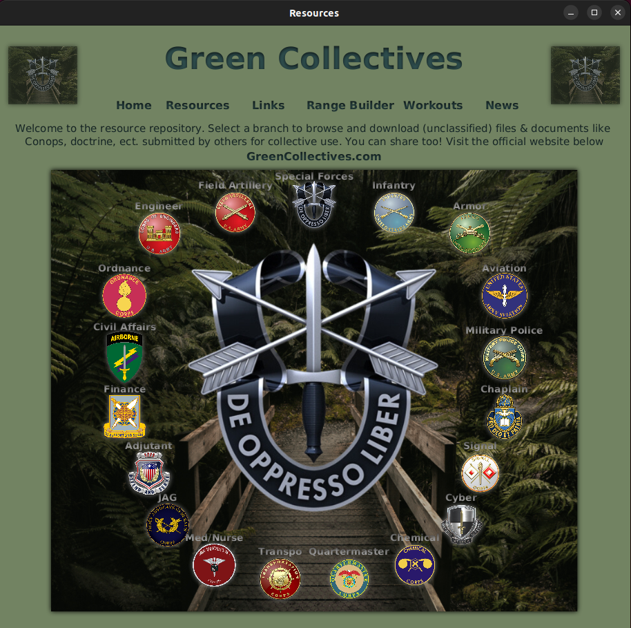
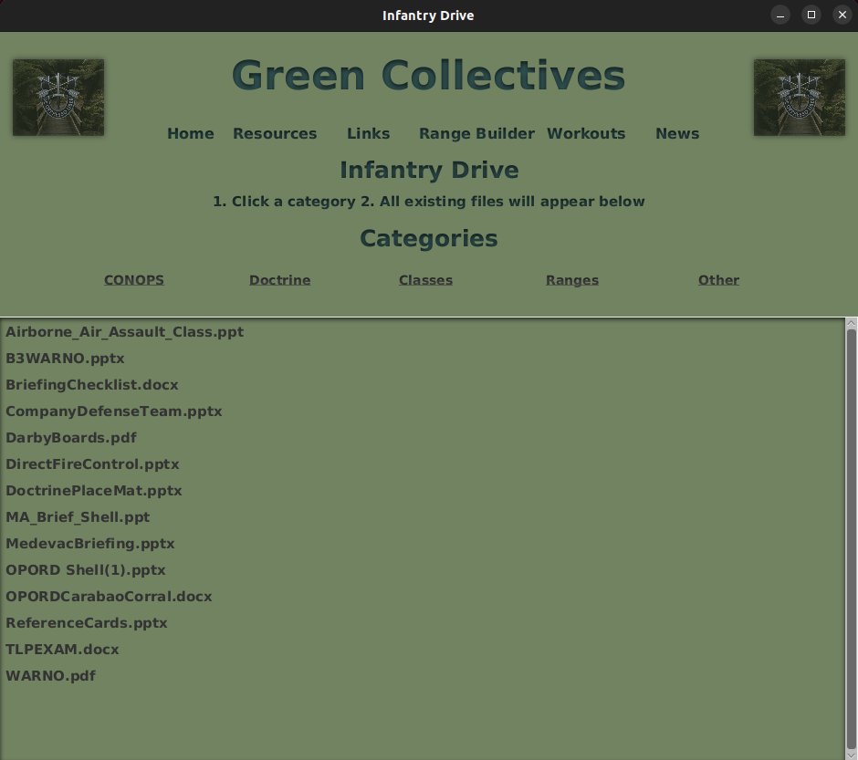
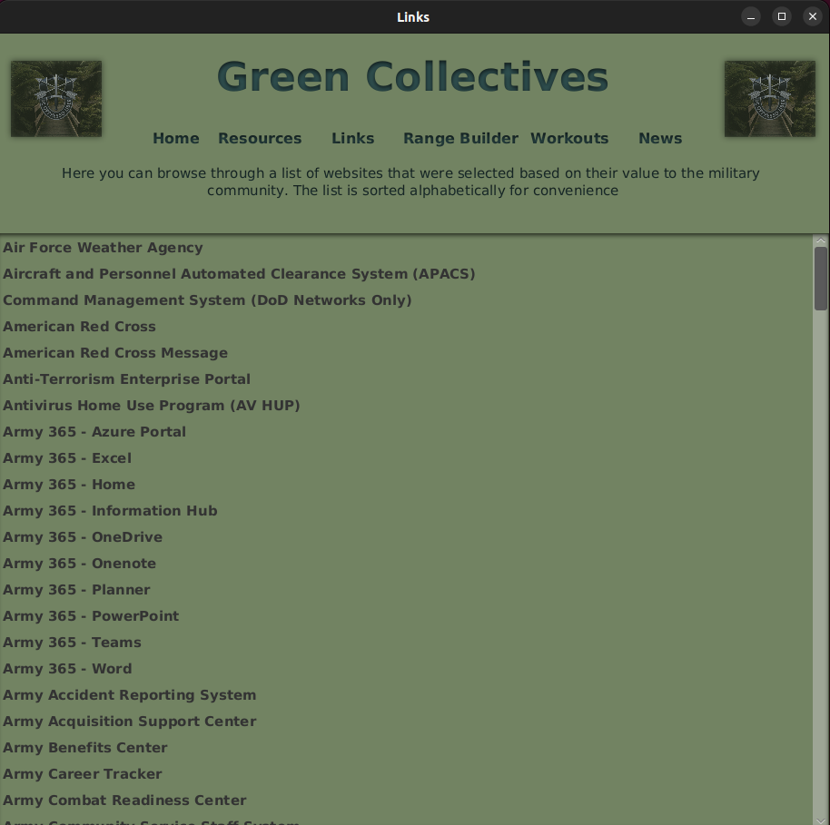
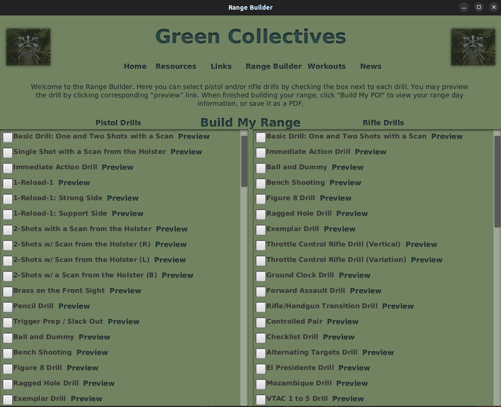
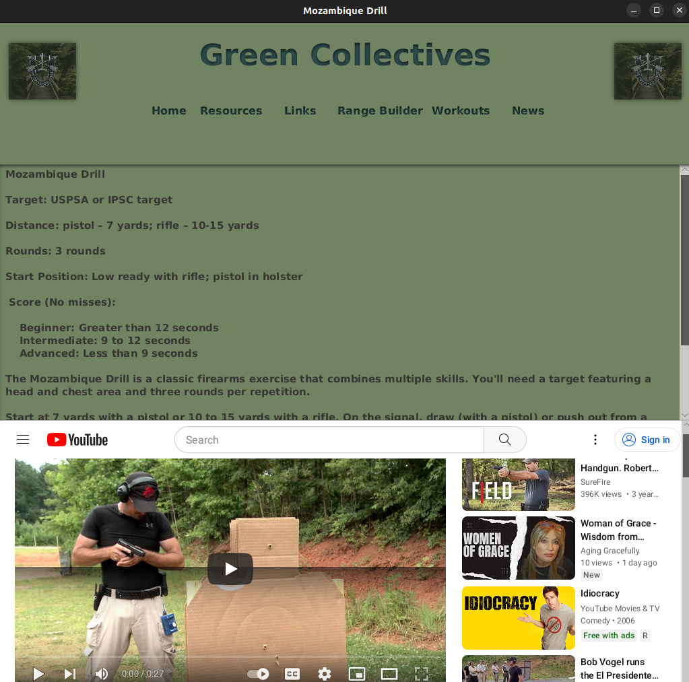
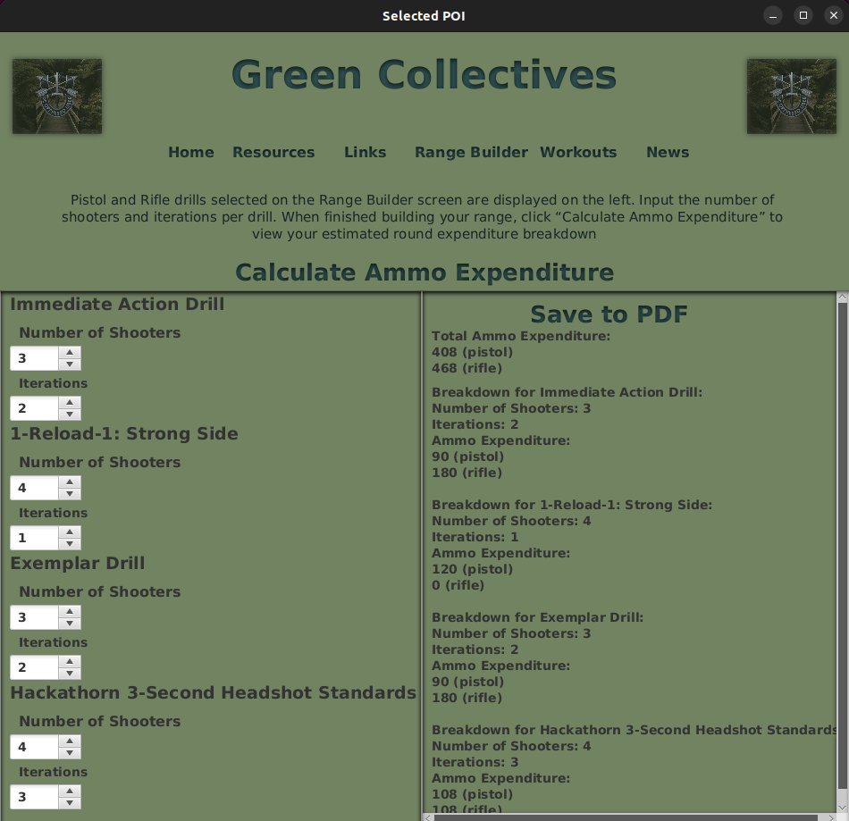
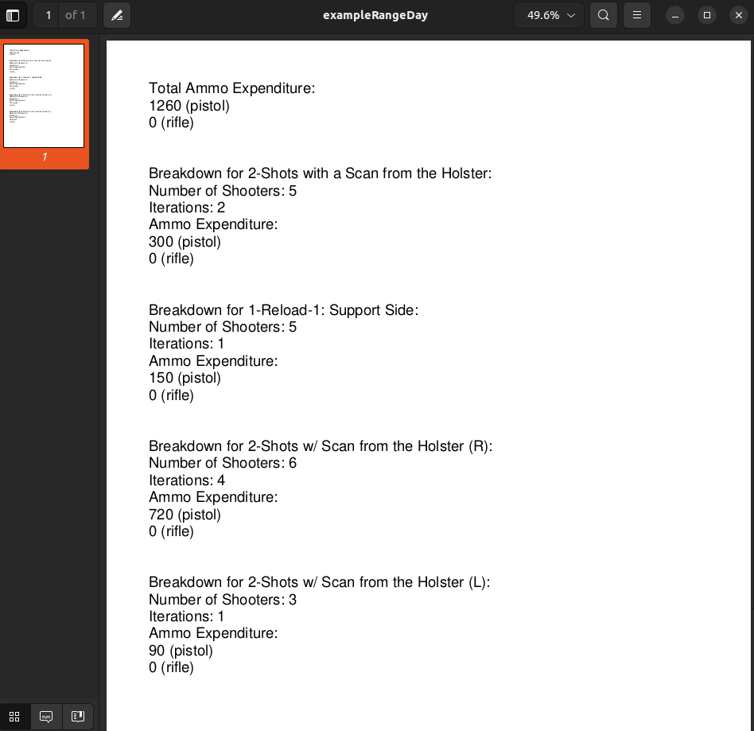
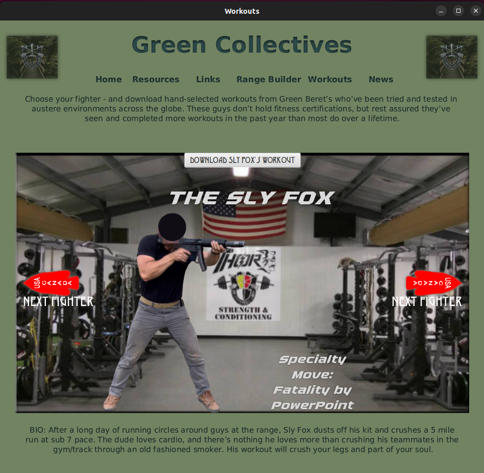
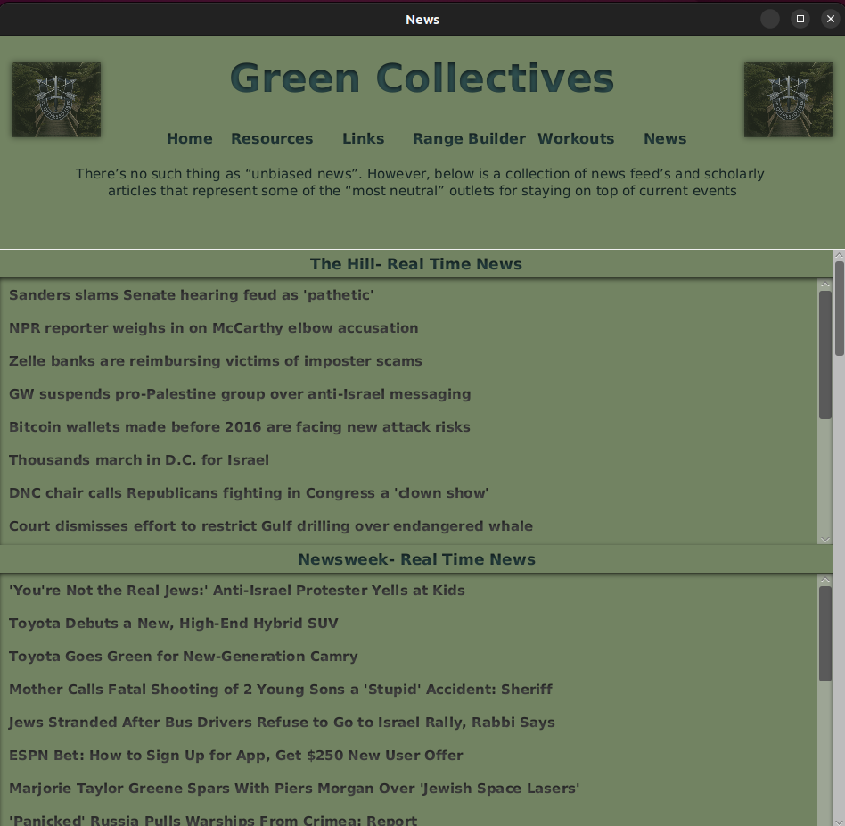
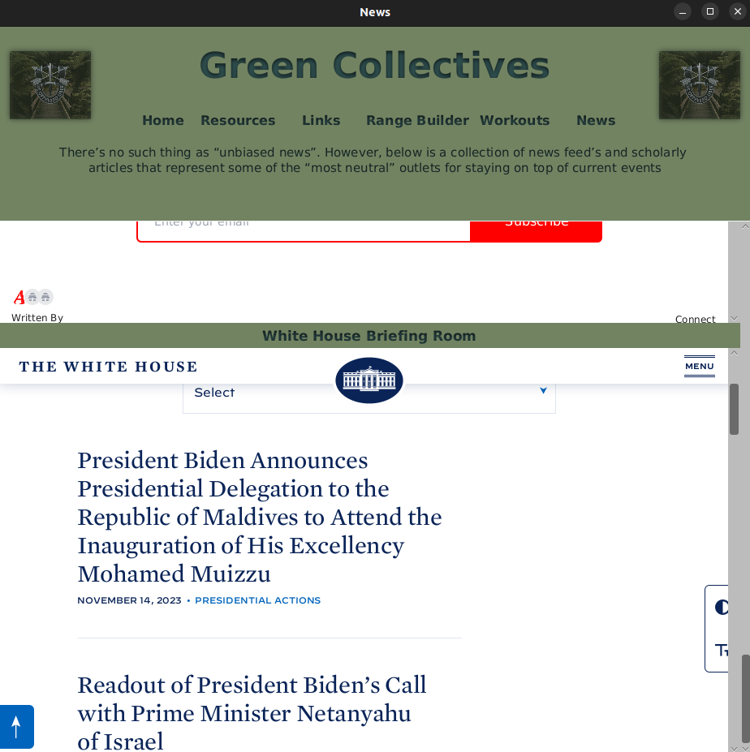

# Green Collectives

A Desktop Application built with javaFx with the intention of solving relevant problems and inefficiencies that U.S. Army Service members, and gun enthusiasts face on a daily basis.

## Description

After 10+ years in the military, I’m well acquatinted with it’s inefficiencies. I wanted to build something to help military personnel with some of their most relevant issues. Green Collectives is a “one-stop-shop” meant to provide soldiers with access to useful files, a consolidated list of military websites, tools to build and manage shooting ranges, competitive workouts, and access to current events.

The application’s features are as follows:

## Resources:

The resources feature has 19 links that load different resource drives. The drives act as file repositories for files that are available for download by utilizing client-initiated GET requests through an HTTP API, which is then routed to a Lambda function in AWS, programmed in Node.js on the backend. This Lambda function generates pre-signed URLs, enabling users to execute their requests. These requests are then directed to an AWS S3 bucket within an encrypted folder. There is also a link to a web application that I built as well that does the same tasks, but it allows you to upload files to contribute as well. It’s important to note that all files are unclassified and are free of PII.

<div style="display: flex; justify-content: space-between;">
  
  
</div>

## Links:

The Links feature compiles every useful military website, selected on their value to the military community. A few of the links require military issued hardware to access.

<div>
  
</div>

## Range Builder:

The Range Builder feature grants access to over to 130+ pistol and rifle drills. Users can use the checkbox to build their desired shooting range. The user can also “preview” each drill to see a detailed list of instructions for each drill, as well as an embedded youtube video. When finished, they select “Build My Range”.

<div style="display: flex; justify-content: space-between;">
  
  
</div>

Users are then prompted to a screen where they can enter amplifying information (number of shooters and iterations per shooter). The user can then click “calculate ammo expenditure” to view their estimated ammunition expenditure for their custom range day. They can then use the Apache pdfbox Library to save to their local device as a pdf.



<div>
  
</div>

Each drill corresponds to a number of estimated rounds expended (per drill) through the use of a list, which is inserted into a hashmap, and passed into another Class through use of a constructor when a new scene is loaded. The end result is a list that can be used in a simple algorithm to calculate ammunition expenditure for any amount of drills.

## Workouts:

The Workouts Feature is a fun take on mortal combat with some of my Green Beret Buddies as substitutes. The user can cycle through a list of Green Berets, and download workouts.
When the user downloads a workout, they are inplimenting the same process as before when requesting to download files from the resources page by making GET requests through an HTTP API – routed to a Lambda function in AWS, programmed in Node.js on the backend. This Lambda function generates pre-signed URLs, enabling users to execute their requests. These requests are then directed to an AWS S3 bucket within an encrypted folder.



## News:

The News Feature utilizes the Java Rome Library, and makes RSS feed requests to several news outlets – The Hill, Newsweek, Rand National Terroism articles, Rand Cyber and Data Science articles, Rand Homeland Security and Public Safety articles, The Army Times, Atlas News, and the White House Briefing room.

<div>
  
 
</div>

## Getting Started

### Dependencies

```xml
- org.apache.pdfbox:pdfbox:2.0.29
- ch.qos.logback:logback-classic:1.4.11
- org.slf4j:slf4j-api:2.0.6
- org.apache.httpcomponents:httpclient:4.5.14
- org.apache.pdfbox:fontbox:2.0.29
- org.openjfx:javafx-web:20
- com.rometools:rome:2.1.0
- org.apache.pdfbox:pdfbox-tools:2.0.29
- org.apache.pdfbox:xmpbox:2.0.29
- com.gluonhq:ignite-common:1.2.2
- org.openjfx:javafx-controls:20
- org.openjfx:javafx-fxml:20
- org.controlsfx:controlsfx:11.1.2
- org.kordamp.bootstrapfx:bootstrapfx-core:0.4.0
- org.junit.jupiter:junit-jupiter-api:5.9.2 (with a 'test' scope)
- org.junit.jupiter:junit-jupiter-engine:5.9.2 (with a 'test' scope)
- com.vaadin.external.google:android-json:0.0.20131108.vaadin1
```
For a complete list of dependencies and their versions, please refer to the [pom.xml](https://github.com/tcdickson/Green-Collectives/blob/master/pom.xml) file.

### Installing

You can download the latest version of our application for the following platforms:

### Windows:

- [Windows Installer (.msi)](https://github.com/tcdickson/Green-Collectives/releases/download/v1.0.1/GreenCollectives-1.0.msi)

### Linux Dedian/Ubuntu:

Easiest Way:

[](https://snapcraft.io/green-collectives)


- [Linux (Debian-based) (.deb)](https://github.com/tcdickson/Green-Collectives/releases/download/v1.0.1/greencollectives_1.0_amd64.deb)

Terminal commands to install after download:

```
cd Downloads
sudo dpkg -i greencollectives_1.0_amd64.deb
```

### macOS AArch64 architecture:

- [macOS (AArch64 architecture) (.dmg)](https://github.com/tcdickson/Green-Collectives/releases/download/v1.0.1/GreenCollectives-1.0.dmg)

## Author

Tyler Dickson
[Email Me](mailto:tylerdickson17@gmail.com)

## License

This project is licensed under the [GNU GENERAL PUBLIC LICENSE VERSION 3](https://github.com/tcdickson/Green-Collectives/blob/master/LICENSE)
